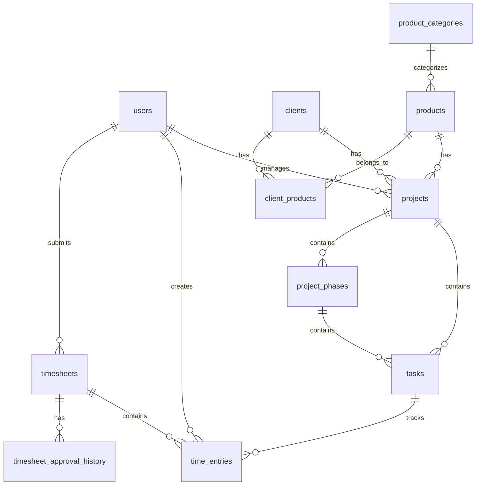
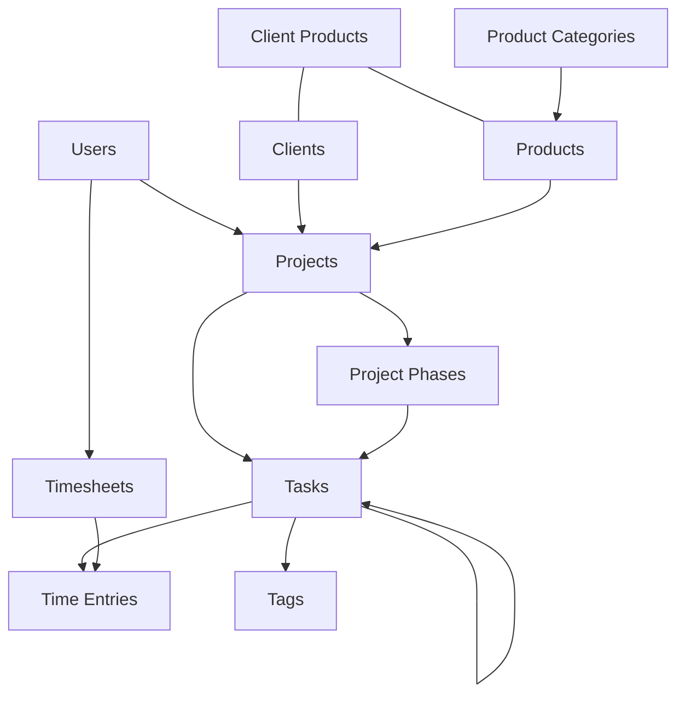
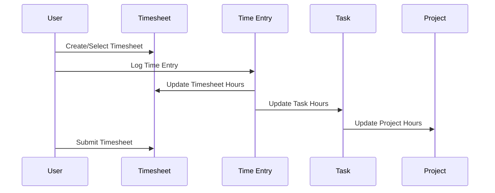
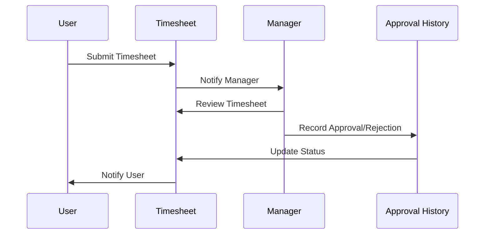
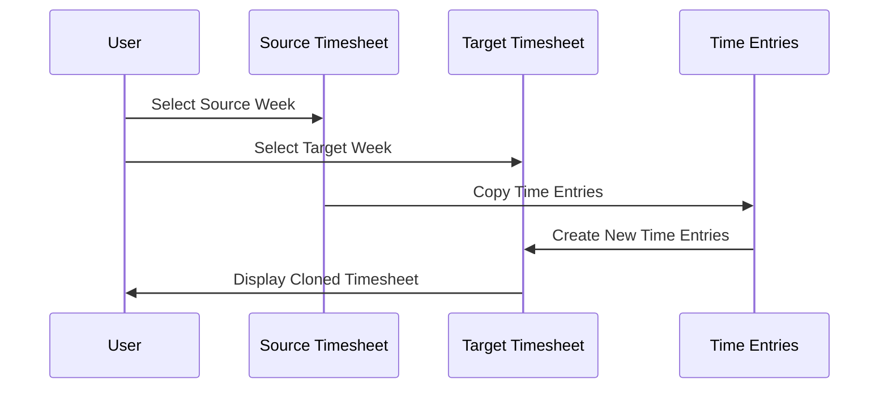
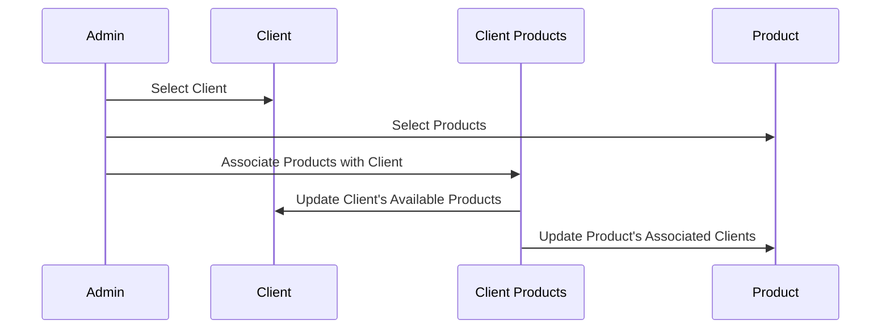

# TrackrEdge Database Design

## How to Use
- For all actionable steps, workflows, and development tasks, refer to the [TrackrEdge Prompt List](TrackrEdge-Prompt-List.md).
- All changes and implementations should be logged in `prompt-log.json` as per the prompt list instructions.
- This ensures consistency and traceability for all database work.

## 1. Schema Overview

### 1.1 Core Tables


### 1.2 Table Definitions

#### users
```sql
CREATE TABLE users (
    id SERIAL PRIMARY KEY,
    username VARCHAR(50) UNIQUE NOT NULL,
    email VARCHAR(100) UNIQUE NOT NULL,
    full_name VARCHAR(100) NOT NULL,
    department VARCHAR(50),
    role_id INTEGER REFERENCES roles(id),
    hourly_rate DECIMAL(10,2) DEFAULT NULL,
    daily_rate DECIMAL(10,2) DEFAULT NULL, 
    standard_hours INTEGER DEFAULT NULL,
    status VARCHAR(20) DEFAULT 'active',
    created_at TIMESTAMP DEFAULT CURRENT_TIMESTAMP,
    modified_at TIMESTAMP DEFAULT CURRENT_TIMESTAMP
);
```

#### roles
```sql
CREATE TABLE roles (
    id SERIAL PRIMARY KEY,
    name VARCHAR(50) UNIQUE NOT NULL,
    description TEXT,
    hourly_rate DECIMAL(10,2) DEFAULT 0.00,
    daily_rate DECIMAL(10,2) DEFAULT 0.00, 
    standard_hours INTEGER DEFAULT 8,
    created_at TIMESTAMP DEFAULT CURRENT_TIMESTAMP,
    modified_at TIMESTAMP DEFAULT CURRENT_TIMESTAMP
);
```

#### role_permissions
```sql
CREATE TABLE role_permissions (
    id SERIAL PRIMARY KEY,
    role_id INTEGER REFERENCES roles(id),
    permission VARCHAR(100) NOT NULL,
    created_at TIMESTAMP DEFAULT CURRENT_TIMESTAMP
);
```

-- Insert default permissions for cost visibility
```sql
INSERT INTO role_permissions (role_id, permission) VALUES 
(1, 'view_cost_data'),  -- Admin role
(1, 'manage_cost_data'), -- Admin role
(2, 'view_cost_data');   -- Manager role
```

#### clients
```sql
CREATE TABLE clients (
    id SERIAL PRIMARY KEY,
    name VARCHAR(100) NOT NULL,
    contact_person VARCHAR(100),
    email VARCHAR(100),
    phone VARCHAR(50),
    address TEXT,
    status VARCHAR(20) DEFAULT 'active',
    active BOOLEAN DEFAULT true,
    created_at TIMESTAMP DEFAULT CURRENT_TIMESTAMP,
    modified_at TIMESTAMP DEFAULT CURRENT_TIMESTAMP
);
```

#### products
```sql
CREATE TABLE products (
    id SERIAL PRIMARY KEY,
    name VARCHAR(100) NOT NULL,
    category_id INTEGER REFERENCES product_categories(id),
    description TEXT,
    price DECIMAL(10,2),
    status VARCHAR(20) DEFAULT 'active',
    active BOOLEAN DEFAULT true,
    created_at TIMESTAMP DEFAULT CURRENT_TIMESTAMP,
    modified_at TIMESTAMP DEFAULT CURRENT_TIMESTAMP
);
```

#### product_categories
```sql
CREATE TABLE product_categories (
    id SERIAL PRIMARY KEY,
    name VARCHAR(100) NOT NULL,
    created_at TIMESTAMP DEFAULT CURRENT_TIMESTAMP,
    modified_at TIMESTAMP DEFAULT CURRENT_TIMESTAMP
);
```

#### client_products
```sql
CREATE TABLE client_products (
    id SERIAL PRIMARY KEY,
    client_id INTEGER REFERENCES clients(id),
    product_id INTEGER REFERENCES products(id),
    created_at TIMESTAMP DEFAULT CURRENT_TIMESTAMP,
    UNIQUE(client_id, product_id)
);
```

#### projects
```sql
CREATE TABLE projects (
    id SERIAL PRIMARY KEY,
    name VARCHAR(100) NOT NULL,
    description TEXT,
    start_date DATE,
    end_date DATE,
    status VARCHAR(20) DEFAULT 'planning',
    client_id INTEGER REFERENCES clients(id),
    product_id INTEGER REFERENCES products(id),
    estimated_hours DECIMAL(10,2),
    active BOOLEAN DEFAULT true,
    created_at TIMESTAMP DEFAULT CURRENT_TIMESTAMP,
    modified_at TIMESTAMP DEFAULT CURRENT_TIMESTAMP
);
```

#### project_phases
```sql
CREATE TABLE project_phases (
    id SERIAL PRIMARY KEY,
    project_id INTEGER REFERENCES projects(id),
    name VARCHAR(100) NOT NULL,
    description TEXT,
    start_date DATE,
    end_date DATE,
    status VARCHAR(20) DEFAULT 'not_started',
    position INTEGER,
    created_at TIMESTAMP DEFAULT CURRENT_TIMESTAMP,
    modified_at TIMESTAMP DEFAULT CURRENT_TIMESTAMP
);
```

#### tasks
```sql
CREATE TABLE tasks (
    id SERIAL PRIMARY KEY,
    title VARCHAR(200) NOT NULL,
    description TEXT,
    status VARCHAR(20) DEFAULT 'new',
    priority VARCHAR(20) DEFAULT 'medium',
    project_id INTEGER REFERENCES projects(id),
    phase_id INTEGER REFERENCES project_phases(id),
    estimated_hours DECIMAL(10,2),
    created_at TIMESTAMP DEFAULT CURRENT_TIMESTAMP,
    modified_at TIMESTAMP DEFAULT CURRENT_TIMESTAMP
);
```

#### timesheets
```sql
CREATE TABLE timesheets (
    id SERIAL PRIMARY KEY,
    user_id INTEGER REFERENCES users(id),
    start_date DATE NOT NULL,
    end_date DATE NOT NULL,
    status VARCHAR(20) DEFAULT 'draft',
    submitted_at TIMESTAMP,
    approved_at TIMESTAMP,
    approved_by INTEGER REFERENCES users(id),
    total_hours DECIMAL(10,2),
    is_compliant BOOLEAN DEFAULT true,
    rejection_reason TEXT,
    created_at TIMESTAMP DEFAULT CURRENT_TIMESTAMP,
    modified_at TIMESTAMP DEFAULT CURRENT_TIMESTAMP
);
```

#### time_entries
```sql
CREATE TABLE time_entries (
    id SERIAL PRIMARY KEY,
    task_id INTEGER REFERENCES tasks(id),
    user_id INTEGER REFERENCES users(id),
    timesheet_id INTEGER REFERENCES timesheets(id),
    hours DECIMAL(5,2) NOT NULL,
    entry_date DATE NOT NULL,
    day_of_week VARCHAR(10),
    notes TEXT,
    status VARCHAR(20) DEFAULT 'draft',
    is_billable BOOLEAN DEFAULT true,
    cost DECIMAL(10,2) GENERATED ALWAYS AS (
        hours * (
            COALESCE(
                (SELECT hourly_rate FROM users WHERE id = user_id),
                (SELECT hourly_rate FROM roles WHERE id = (SELECT role_id FROM users WHERE id = user_id))
            )
        )
    ) STORED,
    last_modified_by INTEGER REFERENCES users(id),
    created_at TIMESTAMP DEFAULT CURRENT_TIMESTAMP,
    modified_at TIMESTAMP DEFAULT CURRENT_TIMESTAMP
);
```

#### timesheet_approval_history
```sql
CREATE TABLE timesheet_approval_history (
    id SERIAL PRIMARY KEY,
    timesheet_id INTEGER REFERENCES timesheets(id),
    status VARCHAR(20) NOT NULL,
    comments TEXT,
    action_by INTEGER REFERENCES users(id),
    created_at TIMESTAMP DEFAULT CURRENT_TIMESTAMP
);
```

#### timesheet_settings
```sql
CREATE TABLE timesheet_settings (
    id SERIAL PRIMARY KEY,
    user_id INTEGER REFERENCES users(id),
    max_weekly_hours INTEGER DEFAULT 40,
    default_billable BOOLEAN DEFAULT true,
    allow_weekend_entries BOOLEAN DEFAULT false,
    created_at TIMESTAMP DEFAULT CURRENT_TIMESTAMP,
    modified_at TIMESTAMP DEFAULT CURRENT_TIMESTAMP
);
```

#### timesheet_templates
```sql
CREATE TABLE timesheet_templates (
    id SERIAL PRIMARY KEY,
    name VARCHAR(100) NOT NULL,
    description TEXT,
    type VARCHAR(20) NOT NULL, -- 'personal', 'team', 'standard'
    created_by INTEGER REFERENCES users(id),
    last_used TIMESTAMP,
    created_at TIMESTAMP DEFAULT CURRENT_TIMESTAMP,
    modified_at TIMESTAMP DEFAULT CURRENT_TIMESTAMP
);
```

#### template_entries
```sql
CREATE TABLE template_entries (
    id SERIAL PRIMARY KEY,
    template_id INTEGER REFERENCES timesheet_templates(id) ON DELETE CASCADE,
    task_id INTEGER REFERENCES tasks(id),
    monday_hours DECIMAL(5,2) DEFAULT 0,
    tuesday_hours DECIMAL(5,2) DEFAULT 0,
    wednesday_hours DECIMAL(5,2) DEFAULT 0,
    thursday_hours DECIMAL(5,2) DEFAULT 0,
    friday_hours DECIMAL(5,2) DEFAULT 0,
    saturday_hours DECIMAL(5,2) DEFAULT 0,
    sunday_hours DECIMAL(5,2) DEFAULT 0,
    is_billable BOOLEAN DEFAULT true,
    created_at TIMESTAMP DEFAULT CURRENT_TIMESTAMP
);
```

#### offline_time_entries
```sql
CREATE TABLE offline_time_entries (
    id SERIAL PRIMARY KEY,
    local_id VARCHAR(100) NOT NULL,
    user_id INTEGER REFERENCES users(id),
    task_id INTEGER REFERENCES tasks(id),
    hours DECIMAL(5,2) NOT NULL,
    entry_date DATE NOT NULL,
    notes TEXT,
    is_billable BOOLEAN DEFAULT true,
    created_at TIMESTAMP,
    synced_at TIMESTAMP DEFAULT CURRENT_TIMESTAMP
);
```

#### project_users
```sql
CREATE TABLE project_users (
    id SERIAL PRIMARY KEY,
    project_id INTEGER REFERENCES projects(id),
    user_id INTEGER REFERENCES users(id),
    created_at TIMESTAMP DEFAULT CURRENT_TIMESTAMP
);
```

#### audit_log
```sql
CREATE TABLE audit_log (
    id SERIAL PRIMARY KEY,
    entity_type VARCHAR(50) NOT NULL,
    entity_id INTEGER NOT NULL,
    action VARCHAR(50) NOT NULL,
    user_id INTEGER REFERENCES users(id),
    ip_address VARCHAR(50),
    user_agent VARCHAR(255),
    details JSONB,
    before_state JSONB,
    after_state JSONB,
    created_at TIMESTAMP DEFAULT CURRENT_TIMESTAMP
);

CREATE INDEX audit_log_entity_idx ON audit_log(entity_type, entity_id);
CREATE INDEX audit_log_user_idx ON audit_log(user_id);
CREATE INDEX audit_log_action_idx ON audit_log(action);
CREATE INDEX audit_log_created_at_idx ON audit_log(created_at);
```

#### role_cost_history
```sql
CREATE TABLE role_cost_history (
    id SERIAL PRIMARY KEY,
    role_id INTEGER REFERENCES roles(id),
    hourly_rate DECIMAL(10,2) NOT NULL,
    daily_rate DECIMAL(10,2) NOT NULL,
    effective_from DATE NOT NULL,
    effective_to DATE,
    created_by INTEGER REFERENCES users(id),
    created_at TIMESTAMP DEFAULT CURRENT_TIMESTAMP
);
```

#### user_cost_history
```sql
CREATE TABLE user_cost_history (
    id SERIAL PRIMARY KEY,
    user_id INTEGER REFERENCES users(id),
    hourly_rate DECIMAL(10,2) NOT NULL,
    daily_rate DECIMAL(10,2) NOT NULL,
    standard_hours INTEGER,
    effective_from DATE NOT NULL,
    effective_to DATE,
    created_by INTEGER REFERENCES users(id),
    created_at TIMESTAMP DEFAULT CURRENT_TIMESTAMP
);
```

#### notifications
```sql
CREATE TABLE notifications (
    id SERIAL PRIMARY KEY,
    user_id INTEGER REFERENCES users(id) NOT NULL,
    title VARCHAR(100) NOT NULL,
    message TEXT NOT NULL,
    type VARCHAR(50) NOT NULL, -- timesheet, project, task, user, system
    priority VARCHAR(20) DEFAULT 'medium', -- high, medium, low, info
    entity_type VARCHAR(50),
    entity_id INTEGER,
    action_url VARCHAR(255),
    action_text VARCHAR(50),
    is_read BOOLEAN DEFAULT FALSE,
    created_at TIMESTAMP DEFAULT CURRENT_TIMESTAMP
);

CREATE INDEX notifications_user_idx ON notifications(user_id);
CREATE INDEX notifications_is_read_idx ON notifications(is_read);
CREATE INDEX notifications_created_at_idx ON notifications(created_at);
```

#### notification_settings
```sql
CREATE TABLE notification_settings (
    id SERIAL PRIMARY KEY,
    user_id INTEGER REFERENCES users(id) NOT NULL,
    notification_type VARCHAR(50) NOT NULL, -- timesheet_reminder, timesheet_approval, etc.
    in_app_enabled BOOLEAN DEFAULT TRUE,
    email_enabled BOOLEAN DEFAULT TRUE,
    created_at TIMESTAMP DEFAULT CURRENT_TIMESTAMP,
    modified_at TIMESTAMP DEFAULT CURRENT_TIMESTAMP,
    UNIQUE(user_id, notification_type)
);
```

#### email_templates
```sql
CREATE TABLE email_templates (
    id SERIAL PRIMARY KEY,
    template_key VARCHAR(50) NOT NULL UNIQUE,
    name VARCHAR(100) NOT NULL,
    subject VARCHAR(200) NOT NULL,
    body TEXT NOT NULL,
    variables JSONB,
    created_at TIMESTAMP DEFAULT CURRENT_TIMESTAMP,
    modified_at TIMESTAMP DEFAULT CURRENT_TIMESTAMP
);
```

#### export_jobs
```sql
CREATE TABLE export_jobs (
    id SERIAL PRIMARY KEY,
    user_id INTEGER REFERENCES users(id) NOT NULL,
    export_type VARCHAR(50) NOT NULL, -- report, timesheet, project, etc.
    format VARCHAR(20) NOT NULL, -- pdf, excel, csv
    parameters JSONB,
    status VARCHAR(20) DEFAULT 'pending', -- pending, processing, completed, failed
    file_path VARCHAR(255),
    error_message TEXT,
    expires_at TIMESTAMP,
    created_at TIMESTAMP DEFAULT CURRENT_TIMESTAMP,
    completed_at TIMESTAMP
);

CREATE INDEX export_jobs_user_idx ON export_jobs(user_id);
CREATE INDEX export_jobs_status_idx ON export_jobs(status);
```

### 1.3 Tenant Management Tables

#### tenants
```sql
CREATE TABLE tenants (
    id SERIAL PRIMARY KEY,
    name VARCHAR(100) NOT NULL,
    subdomain VARCHAR(100) UNIQUE NOT NULL,
    custom_domain VARCHAR(255) UNIQUE,
    database_name VARCHAR(100) NOT NULL,
    status VARCHAR(20) DEFAULT 'active',
    plan_id INTEGER REFERENCES tenant_plans(id),
    created_at TIMESTAMP DEFAULT CURRENT_TIMESTAMP,
    modified_at TIMESTAMP DEFAULT CURRENT_TIMESTAMP
);
```

#### tenant_plans
```sql
CREATE TABLE tenant_plans (
    id SERIAL PRIMARY KEY,
    name VARCHAR(100) NOT NULL,
    description TEXT,
    max_users INTEGER,
    max_projects INTEGER,
    features JSONB,
    price DECIMAL(10,2),
    billing_cycle VARCHAR(20),
    status VARCHAR(20) DEFAULT 'active',
    created_at TIMESTAMP DEFAULT CURRENT_TIMESTAMP,
    modified_at TIMESTAMP DEFAULT CURRENT_TIMESTAMP
);
```

#### tenant_subscriptions
```sql
CREATE TABLE tenant_subscriptions (
    id SERIAL PRIMARY KEY,
    tenant_id INTEGER REFERENCES tenants(id),
    plan_id INTEGER REFERENCES tenant_plans(id),
    start_date DATE NOT NULL,
    end_date DATE,
    status VARCHAR(20) DEFAULT 'active',
    payment_status VARCHAR(20),
    created_at TIMESTAMP DEFAULT CURRENT_TIMESTAMP,
    modified_at TIMESTAMP DEFAULT CURRENT_TIMESTAMP
);
```

#### tenant_settings
```sql
CREATE TABLE tenant_settings (
    id SERIAL PRIMARY KEY,
    tenant_id INTEGER REFERENCES tenants(id),
    setting_key VARCHAR(100) NOT NULL,
    setting_value JSONB,
    created_at TIMESTAMP DEFAULT CURRENT_TIMESTAMP,
    modified_at TIMESTAMP DEFAULT CURRENT_TIMESTAMP,
    UNIQUE(tenant_id, setting_key)
);
```

#### tags
```sql
CREATE TABLE tags (
    id SERIAL PRIMARY KEY,
    name VARCHAR(50) NOT NULL,
    color VARCHAR(7) NOT NULL, -- Hex color code
    description TEXT,
    created_at TIMESTAMP DEFAULT CURRENT_TIMESTAMP,
    modified_at TIMESTAMP DEFAULT CURRENT_TIMESTAMP,
    UNIQUE(name)
);
```

#### task_tags
```sql
CREATE TABLE task_tags (
    task_id INTEGER REFERENCES tasks(id) ON DELETE CASCADE,
    tag_id INTEGER REFERENCES tags(id) ON DELETE CASCADE,
    created_at TIMESTAMP DEFAULT CURRENT_TIMESTAMP,
    PRIMARY KEY (task_id, tag_id)
);

-- Indexes
CREATE INDEX idx_task_tags_task_id ON task_tags(task_id);
CREATE INDEX idx_task_tags_tag_id ON task_tags(tag_id);
```

## 2. Table Relationships

### 2.1 Entity Relationships
- Users can manage multiple Projects (**Project Management**) (1:N)
- Projects can have multiple Tasks (**Task Management**) (1:N)
- Tasks can have multiple Time Entries (**Timesheet Management**) (1:N)
- Tasks can have multiple Tags (**Task Management**) (M:N)
- Clients can have multiple Projects (**Client Management**) (1:N)
- Products can have multiple Projects (**Product Management**) (1:N)
- Each project can have multiple phases (**Phase Management**)
- Each phase can have multiple tasks (**Task Management**)
- Tasks are assigned to a phase via phase_id (**Phase Management**)
- Users submit timesheets that contain multiple time entries (**Timesheet Management**)
- Timesheets have an approval history (**Timesheet Management**)
- Clients can be associated with multiple Products (**Client Management** & **Product Management**) (M:N)
- Products can be associated with multiple Clients (**Product Management** & **Client Management**) (M:N)
- Products belong to a Product Category (N:1)

### 2.2 Relationship Diagrams


## 3. Indexing Strategy

### 3.1 Primary Indexes
- All tables have PRIMARY KEY on id
- Users: username, email
- Projects: name, status
- Tasks: project_id, type, status
- Time Entries: task_id, user_id, entry_date
- Timesheets: user_id, start_date, end_date

### 3.2 Secondary Indexes
```sql
-- Projects
CREATE INDEX idx_projects_client ON projects(client_id);
CREATE INDEX idx_projects_product ON projects(product_id);
CREATE INDEX idx_projects_status ON projects(status);

-- Tasks
CREATE INDEX idx_tasks_project ON tasks(project_id);
CREATE INDEX idx_tasks_phase ON tasks(phase_id);
CREATE INDEX idx_tasks_status ON tasks(status);

-- Time Entries
CREATE INDEX idx_time_entries_date ON time_entries(entry_date);
CREATE INDEX idx_time_entries_user_date ON time_entries(user_id, entry_date);
CREATE INDEX idx_time_entries_status ON time_entries(status);
CREATE INDEX idx_time_entries_timesheet ON time_entries(timesheet_id);
CREATE INDEX idx_time_entries_day_of_week ON time_entries(day_of_week);

-- Timesheets
CREATE INDEX idx_timesheets_user ON timesheets(user_id);
CREATE INDEX idx_timesheets_date_range ON timesheets(start_date, end_date);
CREATE INDEX idx_timesheets_status ON timesheets(status);

-- Timesheet Approval History
CREATE INDEX idx_timesheet_approval_history_timesheet ON timesheet_approval_history(timesheet_id);
CREATE INDEX idx_timesheet_approval_history_status ON timesheet_approval_history(status);

-- Products
CREATE INDEX idx_products_category ON products(category_id);
CREATE INDEX idx_products_status ON products(status);

-- Clients
CREATE INDEX idx_clients_status ON clients(status);
CREATE INDEX idx_clients_name ON clients(name);

-- Client Products
CREATE INDEX idx_client_products_client ON client_products(client_id);
CREATE INDEX idx_client_products_product ON client_products(product_id);
```

## 4. Data Flow

### 4.1 Time Entry Flow


### 4.2 Timesheet Approval Flow


### 4.3 Clone Previous Week Flow


### 4.4 Client-Product Association Flow


## 5. Performance Optimization

### 5.1 Query Optimization
- Use appropriate indexes
- Implement materialized views for reports
- Cache frequently accessed data
- Partition large tables by date

### 5.2 Stored Procedures
```sql
-- Calculate Project Progress
CREATE OR REPLACE FUNCTION calculate_project_progress(project_id INTEGER)
RETURNS DECIMAL AS $$
BEGIN
    RETURN (
        SELECT COALESCE(AVG(
            CASE 
                WHEN estimated_hours > 0 
                THEN (SELECT SUM(hours) FROM time_entries WHERE task_id = tasks.id) / estimated_hours 
                ELSE 0 
            END
        ), 0)
        FROM tasks
        WHERE project_id = $1
    );
END;
$$ LANGUAGE plpgsql;

-- Clone Previous Week Timesheet
CREATE OR REPLACE FUNCTION clone_previous_week(
    user_id INTEGER,
    source_start_date DATE,
    target_start_date DATE,
    include_hours BOOLEAN DEFAULT true,
    include_notes BOOLEAN DEFAULT false
)
RETURNS INTEGER AS $$
DECLARE 
    source_timesheet_id INTEGER;
    target_timesheet_id INTEGER;
    source_end_date DATE;
    target_end_date DATE;
BEGIN
    -- Calculate end dates
    source_end_date := source_start_date + INTERVAL '6 days';
    target_end_date := target_start_date + INTERVAL '6 days';
    
    -- Find source timesheet
    SELECT id INTO source_timesheet_id 
    FROM timesheets 
    WHERE user_id = $1 AND start_date = source_start_date;
    
    -- Create target timesheet if it doesn't exist
    INSERT INTO timesheets (user_id, start_date, end_date, status)
    VALUES (user_id, target_start_date, target_end_date, 'draft')
    ON CONFLICT (user_id, start_date) DO UPDATE 
    SET status = 'draft'
    RETURNING id INTO target_timesheet_id;
    
    -- Clone time entries
    IF include_hours THEN
        INSERT INTO time_entries (
            task_id, user_id, timesheet_id, hours, entry_date, day_of_week, 
            notes, status, is_billable
        )
        SELECT 
            te.task_id, 
            user_id, 
            target_timesheet_id,
            te.hours,
            (te.entry_date - source_start_date) + target_start_date,
            te.day_of_week,
            CASE WHEN include_notes THEN te.notes ELSE NULL END,
            'draft',
            te.is_billable
        FROM time_entries te
        WHERE te.timesheet_id = source_timesheet_id;
    ELSE
        INSERT INTO time_entries (
            task_id, user_id, timesheet_id, hours, entry_date, day_of_week, 
            notes, status, is_billable
        )
        SELECT 
            te.task_id, 
            user_id, 
            target_timesheet_id,
            0,
            (te.entry_date - source_start_date) + target_start_date,
            te.day_of_week,
            CASE WHEN include_notes THEN te.notes ELSE NULL END,
            'draft',
            te.is_billable
        FROM time_entries te
        WHERE te.timesheet_id = source_timesheet_id;
    END IF;
    
    -- Update total hours in target timesheet
    UPDATE timesheets
    SET total_hours = (SELECT SUM(hours) FROM time_entries WHERE timesheet_id = target_timesheet_id)
    WHERE id = target_timesheet_id;
    
    RETURN target_timesheet_id;
END;
$$ LANGUAGE plpgsql;

-- Check Timesheet 40-Hour Compliance
CREATE OR REPLACE FUNCTION check_timesheet_compliance(timesheet_id INTEGER)
RETURNS BOOLEAN AS $$
DECLARE 
    total_hours DECIMAL(10,2);
    max_weekly_hours INTEGER;
    user_id INTEGER;
BEGIN
    -- Get the user ID from the timesheet
    SELECT t.user_id INTO user_id FROM timesheets t WHERE t.id = timesheet_id;
    
    -- Get the max weekly hours from settings
    SELECT ts.max_weekly_hours INTO max_weekly_hours 
    FROM timesheet_settings ts 
    WHERE ts.user_id = user_id;
    
    IF max_weekly_hours IS NULL THEN
        max_weekly_hours := 40;
    END IF;
    
    -- Calculate total hours
    SELECT SUM(hours) INTO total_hours 
    FROM time_entries 
    WHERE timesheet_id = $1;
    
    -- Update timesheet with total hours and compliance
    UPDATE timesheets
    SET 
        total_hours = total_hours,
        is_compliant = (total_hours <= max_weekly_hours)
    WHERE id = timesheet_id;
    
    RETURN (total_hours <= max_weekly_hours);
END;
$$ LANGUAGE plpgsql;

-- Get Client's Available Products
CREATE OR REPLACE FUNCTION get_client_products(client_id INTEGER)
RETURNS TABLE (
    product_id INTEGER,
    product_name VARCHAR,
    product_category VARCHAR,
    product_price DECIMAL
) AS $$
BEGIN
    RETURN QUERY
    SELECT 
        p.id,
        p.name,
        pc.name as category,
        p.price
    FROM 
        products p
    JOIN 
        client_products cp ON p.id = cp.product_id
    JOIN 
        product_categories pc ON p.category_id = pc.id
    WHERE 
        cp.client_id = client_id
    AND
        p.active = true
    ORDER BY 
        pc.name, p.name;
END;
$$ LANGUAGE plpgsql;

-- Get Product's Associated Clients
CREATE OR REPLACE FUNCTION get_product_clients(product_id INTEGER)
RETURNS TABLE (
    client_id INTEGER,
    client_name VARCHAR,
    contact_person VARCHAR,
    email VARCHAR
) AS $$
BEGIN
    RETURN QUERY
    SELECT 
        c.id,
        c.name,
        c.contact_person,
        c.email
    FROM 
        clients c
    JOIN 
        client_products cp ON c.id = cp.client_id
    WHERE 
        cp.product_id = product_id
    AND
        c.active = true
    ORDER BY 
        c.name;
END;
$$ LANGUAGE plpgsql;

-- Update role cost settings and maintain history
CREATE OR REPLACE FUNCTION update_role_cost(
    p_role_id INTEGER,
    p_hourly_rate DECIMAL(10,2),
    p_daily_rate DECIMAL(10,2),
    p_standard_hours INTEGER,
    p_effective_from DATE,
    p_user_id INTEGER
)
RETURNS BOOLEAN AS $$
BEGIN
    -- Close previous cost history record
    UPDATE role_cost_history
    SET effective_to = p_effective_from - INTERVAL '1 day'
    WHERE role_id = p_role_id 
    AND effective_to IS NULL;
    
    -- Insert new cost history record
    INSERT INTO role_cost_history (
        role_id, hourly_rate, daily_rate, 
        effective_from, created_by
    )
    VALUES (
        p_role_id, p_hourly_rate, p_daily_rate, 
        p_effective_from, p_user_id
    );
    
    -- Update role table
    UPDATE roles
    SET 
        hourly_rate = p_hourly_rate,
        daily_rate = p_daily_rate,
        standard_hours = p_standard_hours,
        modified_at = CURRENT_TIMESTAMP
    WHERE id = p_role_id;
    
    RETURN true;
END;
$$ LANGUAGE plpgsql;

-- Update user cost settings and maintain history
CREATE OR REPLACE FUNCTION update_user_cost(
    p_user_id INTEGER,
    p_hourly_rate DECIMAL(10,2),
    p_daily_rate DECIMAL(10,2),
    p_standard_hours INTEGER,
    p_effective_from DATE,
    p_admin_id INTEGER
)
RETURNS BOOLEAN AS $$
BEGIN
    -- Close previous cost history record
    UPDATE user_cost_history
    SET effective_to = p_effective_from - INTERVAL '1 day'
    WHERE user_id = p_user_id 
    AND effective_to IS NULL;
    
    -- Insert new cost history record
    INSERT INTO user_cost_history (
        user_id, hourly_rate, daily_rate, standard_hours,
        effective_from, created_by
    )
    VALUES (
        p_user_id, p_hourly_rate, p_daily_rate, p_standard_hours,
        p_effective_from, p_admin_id
    );
    
    -- Update user table
    UPDATE users
    SET 
        hourly_rate = p_hourly_rate,
        daily_rate = p_daily_rate,
        standard_hours = p_standard_hours,
        modified_at = CURRENT_TIMESTAMP
    WHERE id = p_user_id;
    
    RETURN true;
END;
$$ LANGUAGE plpgsql;

-- Get effective cost rate for a user (either user-specific or role-based)
CREATE OR REPLACE FUNCTION get_user_effective_rate(p_user_id INTEGER)
RETURNS TABLE (
    hourly_rate DECIMAL(10,2),
    daily_rate DECIMAL(10,2),
    standard_hours INTEGER,
    source VARCHAR
) AS $$
BEGIN
    -- Check if user has specific rates set
    IF EXISTS (
        SELECT 1 FROM users 
        WHERE id = p_user_id 
        AND hourly_rate IS NOT NULL
    ) THEN
        RETURN QUERY
        SELECT 
            u.hourly_rate,
            u.daily_rate,
            COALESCE(u.standard_hours, r.standard_hours),
            'user'::VARCHAR as source
        FROM users u
        LEFT JOIN roles r ON u.role_id = r.id
        WHERE u.id = p_user_id;
    ELSE
        -- Get rates from user's role
        RETURN QUERY
        SELECT 
            r.hourly_rate,
            r.daily_rate,
            r.standard_hours,
            'role'::VARCHAR as source
        FROM users u
        JOIN roles r ON u.role_id = r.id
        WHERE u.id = p_user_id;
    END IF;
END;
$$ LANGUAGE plpgsql;

-- Calculate timesheet costs
CREATE OR REPLACE FUNCTION calculate_timesheet_costs(
    p_user_id INTEGER,
    p_start_date DATE,
    p_end_date DATE
)
RETURNS TABLE (
    total_cost DECIMAL(10,2),
    billable_cost DECIMAL(10,2),
    non_billable_cost DECIMAL(10,2),
    role_id INTEGER,
    role_name VARCHAR,
    hourly_rate DECIMAL(10,2),
    daily_rate DECIMAL(10,2),
    rate_source VARCHAR,
    monday_cost DECIMAL(10,2),
    tuesday_cost DECIMAL(10,2),
    wednesday_cost DECIMAL(10,2),
    thursday_cost DECIMAL(10,2),
    friday_cost DECIMAL(10,2),
    saturday_cost DECIMAL(10,2),
    sunday_cost DECIMAL(10,2)
) AS $$
DECLARE
    v_role_id INTEGER;
    v_hourly_rate DECIMAL(10,2);
    v_rate_source VARCHAR;
BEGIN
    -- Get user's role
    SELECT role_id INTO v_role_id
    FROM users
    WHERE id = p_user_id;
    
    -- Get effective hourly rate (user-specific or role-based)
    SELECT er.hourly_rate, er.source INTO v_hourly_rate, v_rate_source
    FROM get_user_effective_rate(p_user_id) er;
    
    -- Calculate costs
    RETURN QUERY
    WITH daily_costs AS (
        SELECT 
            LOWER(TO_CHAR(te.entry_date, 'day')) AS day_name,
            SUM(te.hours * v_hourly_rate) AS day_cost,
            SUM(CASE WHEN te.is_billable THEN te.hours * v_hourly_rate ELSE 0 END) AS day_billable_cost,
            SUM(CASE WHEN NOT te.is_billable THEN te.hours * v_hourly_rate ELSE 0 END) AS day_non_billable_cost
        FROM time_entries te
        WHERE te.user_id = p_user_id
        AND te.entry_date BETWEEN p_start_date AND p_end_date
        GROUP BY LOWER(TO_CHAR(te.entry_date, 'day'))
    )
    SELECT 
        SUM(day_cost) AS total_cost,
        SUM(day_billable_cost) AS billable_cost,
        SUM(day_non_billable_cost) AS non_billable_cost,
        v_role_id,
        (SELECT name FROM roles WHERE id = v_role_id),
        v_hourly_rate,
        (CASE 
            WHEN v_rate_source = 'user' THEN (SELECT daily_rate FROM users WHERE id = p_user_id)
            ELSE (SELECT daily_rate FROM roles WHERE id = v_role_id)
         END),
        v_rate_source,
        (SELECT day_cost FROM daily_costs WHERE day_name = 'monday' LIMIT 1),
        (SELECT day_cost FROM daily_costs WHERE day_name = 'tuesday' LIMIT 1),
        (SELECT day_cost FROM daily_costs WHERE day_name = 'wednesday' LIMIT 1),
        (SELECT day_cost FROM daily_costs WHERE day_name = 'thursday' LIMIT 1),
        (SELECT day_cost FROM daily_costs WHERE day_name = 'friday' LIMIT 1),
        (SELECT day_cost FROM daily_costs WHERE day_name = 'saturday' LIMIT 1),
        (SELECT day_cost FROM daily_costs WHERE day_name = 'sunday' LIMIT 1)
    FROM daily_costs;
END;
$$ LANGUAGE plpgsql;

-- Generate project cost report
CREATE OR REPLACE FUNCTION generate_project_cost_report(
    p_project_id INTEGER,
    p_start_date DATE DEFAULT NULL,
    p_end_date DATE DEFAULT NULL,
    p_group_by VARCHAR DEFAULT 'role'
)
RETURNS TABLE (
    group_name VARCHAR,
    total_hours DECIMAL(10,2),
    total_cost DECIMAL(10,2),
    percentage DECIMAL(5,2)
) AS $$
DECLARE
    v_total_cost DECIMAL(10,2);
    v_date_filter BOOLEAN;
BEGIN
    -- Check if we need date filtering
    v_date_filter := p_start_date IS NOT NULL AND p_end_date IS NOT NULL;
    
    -- Calculate total cost first (for percentage calculation)
    IF v_date_filter THEN
        SELECT SUM(te.cost)
        INTO v_total_cost
        FROM time_entries te
        JOIN tasks t ON te.task_id = t.id
        WHERE t.project_id = p_project_id
        AND te.entry_date BETWEEN p_start_date AND p_end_date;
    ELSE
        SELECT SUM(te.cost)
        INTO v_total_cost
        FROM time_entries te
        JOIN tasks t ON te.task_id = t.id
        WHERE t.project_id = p_project_id;
    END IF;
    
    -- Return grouped data
    IF p_group_by = 'role' THEN
        RETURN QUERY
        SELECT 
            r.name AS group_name,
            SUM(te.hours) AS total_hours,
            SUM(te.cost) AS total_cost,
            SUM(te.cost) * 100 / v_total_cost AS percentage
        FROM time_entries te
        JOIN users u ON te.user_id = u.id
        JOIN roles r ON u.role_id = r.id
        JOIN tasks t ON te.task_id = t.id
        WHERE t.project_id = p_project_id
        AND (NOT v_date_filter OR te.entry_date BETWEEN p_start_date AND p_end_date)
        GROUP BY r.name
        ORDER BY total_cost DESC;
        
    ELSIF p_group_by = 'user' THEN
        RETURN QUERY
        SELECT 
            u.full_name AS group_name,
            SUM(te.hours) AS total_hours,
            SUM(te.cost) AS total_cost,
            SUM(te.cost) * 100 / v_total_cost AS percentage
        FROM time_entries te
        JOIN users u ON te.user_id = u.id
        JOIN tasks t ON te.task_id = t.id
        WHERE t.project_id = p_project_id
        AND (NOT v_date_filter OR te.entry_date BETWEEN p_start_date AND p_end_date)
        GROUP BY u.full_name
        ORDER BY total_cost DESC;
        
    ELSIF p_group_by = 'phase' THEN
        RETURN QUERY
        SELECT 
            pp.name AS group_name,
            SUM(te.hours) AS total_hours,
            SUM(te.cost) AS total_cost,
            SUM(te.cost) * 100 / v_total_cost AS percentage
        FROM time_entries te
        JOIN tasks t ON te.task_id = t.id
        JOIN project_phases pp ON t.phase_id = pp.id
        WHERE t.project_id = p_project_id
        AND (NOT v_date_filter OR te.entry_date BETWEEN p_start_date AND p_end_date)
        GROUP BY pp.name
        ORDER BY total_cost DESC;
        
    ELSIF p_group_by = 'task' THEN
        RETURN QUERY
        SELECT 
            t.title AS group_name,
            SUM(te.hours) AS total_hours,
            SUM(te.cost) AS total_cost,
            SUM(te.cost) * 100 / v_total_cost AS percentage
        FROM time_entries te
        JOIN tasks t ON te.task_id = t.id
        WHERE t.project_id = p_project_id
        AND (NOT v_date_filter OR te.entry_date BETWEEN p_start_date AND p_end_date)
        GROUP BY t.title
        ORDER BY total_cost DESC;
    END IF;
END;
$$ LANGUAGE plpgsql;

-- Clone Project with Resource Allocation
CREATE OR REPLACE FUNCTION clone_project(
    p_source_project_id INTEGER,
    p_new_name VARCHAR(100),
    p_new_description TEXT DEFAULT NULL,
    p_new_start_date DATE DEFAULT NULL,
    p_new_end_date DATE DEFAULT NULL,
    p_include_phases BOOLEAN DEFAULT true,
    p_include_tasks BOOLEAN DEFAULT true,
    p_include_team_members BOOLEAN DEFAULT true,
    p_user_id INTEGER
)
RETURNS INTEGER AS $$
DECLARE
    v_new_project_id INTEGER;
    v_phase RECORD;
    v_new_phase_id INTEGER;
    v_task RECORD;
    v_phase_mapping JSON := '{}';
    v_source_project RECORD;
BEGIN
    -- Get source project details
    SELECT * INTO v_source_project FROM projects WHERE id = p_source_project_id;
    
    IF NOT FOUND THEN
        RAISE EXCEPTION 'Source project with ID % not found', p_source_project_id;
    END IF;
    
    -- Create new project
    INSERT INTO projects (
        name, 
        description, 
        start_date, 
        end_date, 
        status,
        client_id, 
        product_id, 
        estimated_hours,
        active
    ) VALUES (
        p_new_name,
        COALESCE(p_new_description, v_source_project.description),
        COALESCE(p_new_start_date, v_source_project.start_date),
        COALESCE(p_new_end_date, v_source_project.end_date),
        'planning',
        v_source_project.client_id,
        v_source_project.product_id,
        v_source_project.estimated_hours,
        true
    ) RETURNING id INTO v_new_project_id;
    
    -- Log the clone action
    INSERT INTO audit_log (
        entity_type, 
        entity_id, 
        action, 
        user_id, 
        details
    ) VALUES (
        'project',
        v_new_project_id,
        'clone',
        p_user_id,
        jsonb_build_object(
            'source_project_id', p_source_project_id,
            'include_phases', p_include_phases,
            'include_tasks', p_include_tasks,
            'include_team_members', p_include_team_members
        )
    );
    
    -- Clone project phases if requested
    IF p_include_phases THEN
        FOR v_phase IN SELECT * FROM project_phases WHERE project_id = p_source_project_id ORDER BY position
        LOOP
            INSERT INTO project_phases (
                project_id,
                name,
                description,
                start_date,
                end_date,
                status,
                position
            ) VALUES (
                v_new_project_id,
                v_phase.name,
                v_phase.description,
                CASE 
                    WHEN p_new_start_date IS NOT NULL THEN 
                        p_new_start_date + (v_phase.start_date - v_source_project.start_date)
                    ELSE 
                        v_phase.start_date
                END,
                CASE 
                    WHEN p_new_end_date IS NOT NULL THEN 
                        p_new_end_date - (v_source_project.end_date - v_phase.end_date)
                    ELSE 
                        v_phase.end_date
                END,
                'not_started',
                v_phase.position
            ) RETURNING id INTO v_new_phase_id;
            
            -- Store phase mapping for tasks
            v_phase_mapping := v_phase_mapping || jsonb_build_object(v_phase.id::text, v_new_phase_id);
        END LOOP;
    END IF;
    
    -- Clone tasks if requested
    IF p_include_tasks THEN
        FOR v_task IN SELECT * FROM tasks WHERE project_id = p_source_project_id
        LOOP
            INSERT INTO tasks (
                project_id,
                phase_id,
                title,
                description,
                status,
                priority,
                estimated_hours
            ) VALUES (
                v_new_project_id,
                CASE 
                    WHEN p_include_phases AND v_task.phase_id IS NOT NULL THEN 
                        (v_phase_mapping->>(v_task.phase_id)::text)::integer
                    ELSE 
                        NULL
                END,
                v_task.title,
                v_task.description,
                'new',
                v_task.priority,
                v_task.estimated_hours
            );
        END LOOP;
    END IF;
    
    -- Clone team members (project_users) if requested
    IF p_include_team_members THEN
        INSERT INTO project_users (
            project_id,
            user_id
        )
        SELECT 
            v_new_project_id,
            user_id
        FROM 
            project_users
        WHERE 
            project_id = p_source_project_id;
    END IF;
    
    RETURN v_new_project_id;
END;
$$ LANGUAGE plpgsql;

## 6. Data Integrity

### 6.1 Constraints
- Foreign key constraints
- Check constraints for status values
- Unique constraints for business keys
- Not null constraints for required fields

### 6.2 Triggers
```sql
-- Update modified_at timestamp
CREATE OR REPLACE FUNCTION update_modified_at()
RETURNS TRIGGER AS $$
BEGIN
    NEW.modified_at = CURRENT_TIMESTAMP;
    RETURN NEW;
END;
$$ LANGUAGE plpgsql;

-- Apply to all tables
CREATE TRIGGER update_users_modified
    BEFORE UPDATE ON users
    FOR EACH ROW
    EXECUTE FUNCTION update_modified_at();

-- Add day_of_week to time entries
CREATE OR REPLACE FUNCTION set_day_of_week()
RETURNS TRIGGER AS $$
BEGIN
    NEW.day_of_week = LOWER(TO_CHAR(NEW.entry_date, 'day'));
    RETURN NEW;
END;
$$ LANGUAGE plpgsql;

CREATE TRIGGER set_time_entry_day_of_week
    BEFORE INSERT OR UPDATE ON time_entries
    FOR EACH ROW
    EXECUTE FUNCTION set_day_of_week();

-- Update timesheet total hours when time entries change
CREATE OR REPLACE FUNCTION update_timesheet_hours()
RETURNS TRIGGER AS $$
BEGIN
    UPDATE timesheets
    SET total_hours = (SELECT SUM(hours) FROM time_entries WHERE timesheet_id = NEW.timesheet_id)
    WHERE id = NEW.timesheet_id;
    
    -- Check 40-hour compliance
    PERFORM check_timesheet_compliance(NEW.timesheet_id);
    
    RETURN NEW;
END;
$$ LANGUAGE plpgsql;

CREATE TRIGGER update_timesheet_hours_trigger
    AFTER INSERT OR UPDATE OR DELETE ON time_entries
    FOR EACH ROW
    EXECUTE FUNCTION update_timesheet_hours();

-- Log client-product associations
CREATE OR REPLACE FUNCTION log_client_product_changes()
RETURNS TRIGGER AS $$
BEGIN
    IF TG_OP = 'INSERT' THEN
        INSERT INTO audit_log (entity_type, entity_id, action, details)
        VALUES ('client_product', NEW.id, 'associate', 
            jsonb_build_object('client_id', NEW.client_id, 'product_id', NEW.product_id));
    ELSIF TG_OP = 'DELETE' THEN
        INSERT INTO audit_log (entity_type, entity_id, action, details)
        VALUES ('client_product', OLD.id, 'disassociate', 
            jsonb_build_object('client_id', OLD.client_id, 'product_id', OLD.product_id));
    END IF;
    RETURN NULL;
END;
$$ LANGUAGE plpgsql;

CREATE TRIGGER log_client_product_changes_trigger
    AFTER INSERT OR DELETE ON client_products
    FOR EACH ROW
    EXECUTE FUNCTION log_client_product_changes();
```

## 7. Backup & Recovery

### 7.1 Backup Strategy
- Daily full backups
- Hourly incremental backups
- Point-in-time recovery
- Transaction log backups

### 7.2 Recovery Procedures
- Database restore procedures
- Data recovery workflows
- Disaster recovery plan
- Backup verification process 

## 8. Timesheet-specific Data Operations

### 8.1 Calculate Daily and Weekly Totals
```sql
-- Example query for daily totals
SELECT 
    EXTRACT(DOW FROM entry_date) as day_number,
    TO_CHAR(entry_date, 'Day') as day_name,
    SUM(hours) as total_hours
FROM time_entries
WHERE timesheet_id = :timesheet_id
GROUP BY EXTRACT(DOW FROM entry_date), TO_CHAR(entry_date, 'Day')
ORDER BY day_number;
```

### 8.2 Bulk Time Entry Update
```sql
-- Example query for bulk updating time entries for specific days
UPDATE time_entries
SET hours = :hours
WHERE 
    timesheet_id = :timesheet_id AND
    task_id = :task_id AND
    day_of_week IN (:day_list);
```

## 9. Client-Product Management Queries

### 9.1 Get Projects by Client and Product
```sql
-- Find all projects for a specific client and product
SELECT 
    p.id,
    p.name,
    p.status,
    p.start_date,
    p.end_date,
    p.estimated_hours,
    SUM(te.hours) as actual_hours
FROM 
    projects p
LEFT JOIN 
    tasks t ON p.id = t.project_id
LEFT JOIN 
    time_entries te ON t.id = te.task_id
WHERE 
    p.client_id = :client_id
AND 
    p.product_id = :product_id
GROUP BY 
    p.id, p.name, p.status, p.start_date, p.end_date, p.estimated_hours
ORDER BY 
    p.start_date DESC;
```

### 9.2 Client-Product Usage Analytics
```sql
-- Get product usage statistics by client
SELECT 
    c.name as client_name,
    p.name as product_name,
    pc.name as category,
    COUNT(DISTINCT proj.id) as project_count,
    SUM(te.hours) as total_hours,
    MIN(proj.start_date) as first_usage_date,
    MAX(proj.start_date) as latest_usage_date
FROM 
    clients c
JOIN 
    client_products cp ON c.id = cp.client_id
JOIN 
    products p ON cp.product_id = p.id
JOIN 
    product_categories pc ON p.category_id = pc.id
LEFT JOIN 
    projects proj ON (c.id = proj.client_id AND p.id = proj.product_id)
LEFT JOIN 
    tasks t ON proj.id = t.project_id
LEFT JOIN 
    time_entries te ON t.id = te.task_id
WHERE 
    c.active = true
AND 
    p.active = true
GROUP BY 
    c.name, p.name, pc.name
ORDER BY 
    total_hours DESC;
``` 